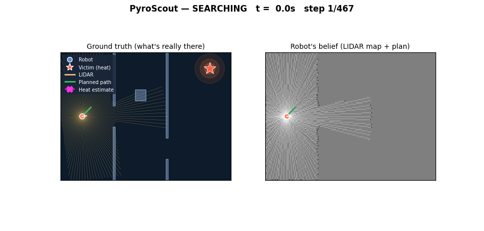
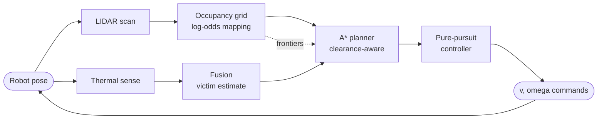
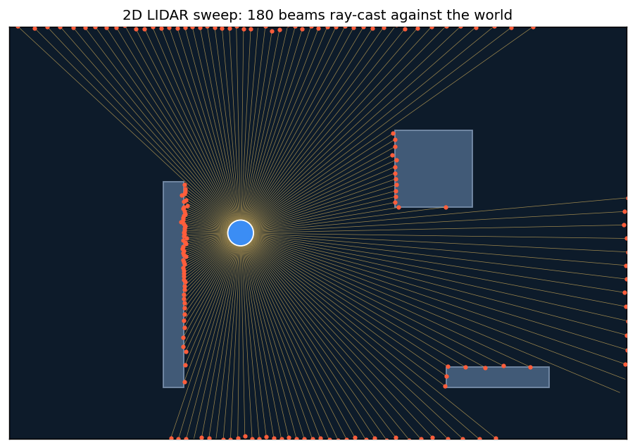
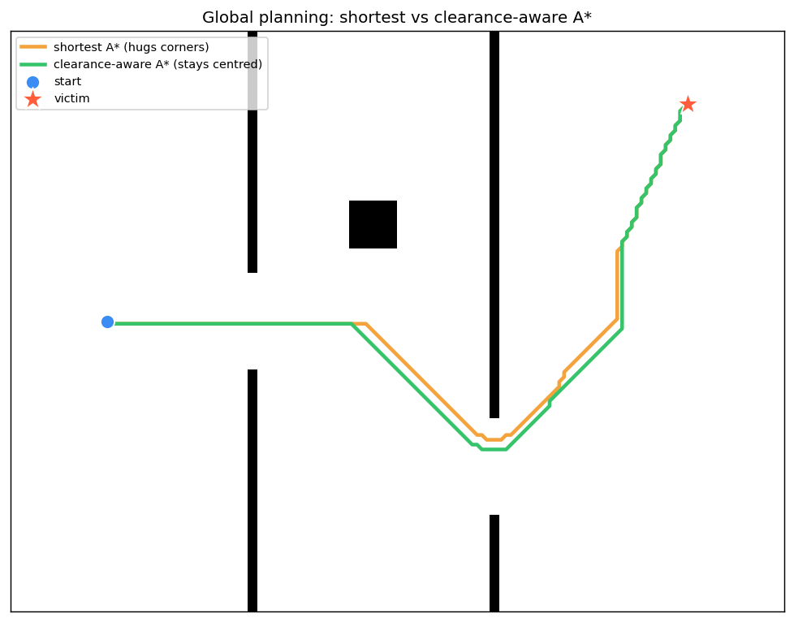
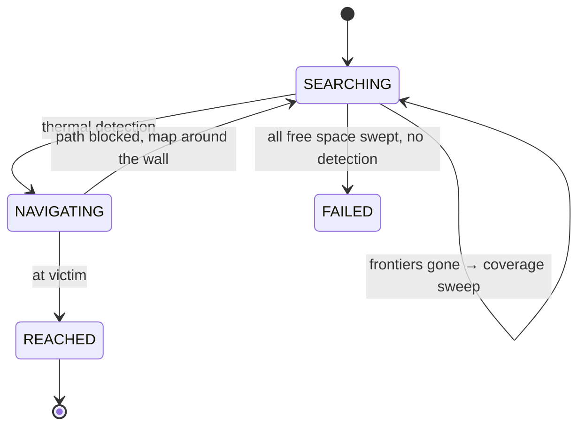

# 🔥🤖 PyroScout — Thermal-LIDAR Fusion for Autonomous Search-and-Rescue

[](https://github.com/a-haz/project-00/actions/workflows/ci.yml)
[](https://www.python.org/)
[](LICENSE)
[](tests/)

A from-scratch 2D robotics simulator in which a mobile robot is dropped into a
building it has **never seen**, and must **find a victim** using two
complementary senses — exactly the thermal + LIDAR pairing studied in autonomous
search-and-rescue navigation:

| Sense | Sensor | Question it answers |
|------|--------|--------------------|
| 📡 **Geometry** | 2D LIDAR (360° ranging) | *"Where are the walls?"* — builds a map from nothing |
| 🌡️ **Semantics** | Thermal sensor | *"Where is the heat?"* — tells the robot **what** to go to |

The robot **fuses** them: LIDAR builds the map, the thermal sensor picks the
goal, and a behaviour state machine drives the robot to **explore → detect →
plan → navigate → arrive** — all autonomously, and without ever touching a wall.

<p align="center">
  
</p>

> **Left:** the ground truth the robot can't see — walls, a pillar, the victim's
> heat signature (★), and the live LIDAR fan.
> **Right:** the occupancy-grid map the robot *infers* from LIDAR, with its
> live plan drawn on top. Watch the right panel fill in as the robot explores.

📓 **Prefer a narrated walk-through?** Read
[`notebooks/pyroscout_writeup.ipynb`](notebooks/pyroscout_writeup.ipynb) — a
blog-style article that builds the whole system, layer by layer, with runnable
code and inline figures.

---

## 📊 Results

Running the bundled scenario (`seed=0`): the robot starts blind in the left
room and the victim is two offset doorways away, out of thermal line-of-sight.

| Metric | Value |
|---|---|
| Outcome | ✅ Victim reached |
| Wall collisions | **0** |
| Victim localisation error (thermal+LIDAR fusion) | **1.2 cm** |
| Distance travelled | 25.1 m |
| Map coverage at finish | ~100% of the building |

Across a **100-seed Monte-Carlo**: 99% success, **0 collisions in every
episode**, median time-to-rescue 42.5 s, victim localised to a median
**1.5 cm**. The full quantitative study — sensor-degradation sweeps, failure
anatomy, and 60 randomized victim placements (60/60 reached) — lives in
[`analysis/ANALYSIS.md`](analysis/ANALYSIS.md); reproduce it with
`python analysis/run_analysis.py`.

The study also found (and fixed) a real capability gap: with a short-range
(≤ 4 m) thermal sensor the robot used to map the whole building, never get a
detection, and give up — 0–5% success no matter how much time it was given.
The **coverage-search fallback** born from that finding lifts those cells to
**100%** at a 210 s budget (see §8 of the analysis).

---

## 🧠 The autonomy stack

PyroScout implements the classic mobile-robot pipeline, one module per layer:



| Layer | Module | Concept demonstrated |
|---|---|---|
| Body | [`robot.py`](pyroscout/robot.py) | Differential-drive kinematics (exact arc integration) |
| Perception | [`sensors/lidar.py`](pyroscout/sensors/lidar.py) | Vectorised ray-casting range sensing + noise |
| Perception | [`sensors/thermal.py`](pyroscout/sensors/thermal.py) | Inverse-square thermal model, occlusion, range-from-intensity |
| Mapping | [`mapping/occupancy_grid.py`](pyroscout/mapping/occupancy_grid.py) | Log-odds occupancy grids, frontier detection, clearance transform |
| Planning | [`planning/astar.py`](pyroscout/planning/astar.py) | A* graph search, corner-cut prevention, cost fields |
| Control | [`control/pure_pursuit.py`](pyroscout/control/pure_pursuit.py) | Geometric path following |
| Brain | [`navigator.py`](pyroscout/navigator.py) | Sensor fusion + behaviour state machine + exploration |

---

## 🔬 How it works

### 1. Sensing the world

**LIDAR** is simulated by casting one ray per beam and finding the nearest wall
segment it strikes — a single vectorised linear-algebra solve handles all
beams against all walls at once (see `cast_rays` in
[`geometry.py`](pyroscout/geometry.py)). Gaussian noise is added to mimic a real
sensor.

<p align="center"></p>

**The thermal sensor** is what makes this a *search* problem. Radiated power
falls off with the square of distance, so a source of strength `I0` at distance
`d` reads:

```
measured = I0 / (d**2 + 1)
```

Because that's invertible, the sensor recovers a **range estimate** from a raw
intensity reading: `d_est = sqrt(I0 / measured - 1)`. Two effects make it
realistic and the problem hard:

- **Occlusion** — infrared is blocked by walls, so the victim is only detected
  with clear line of sight (checked with a ray cast). The robot must physically
  *get around corners* before it can "see" the heat.
- **Noise** — bearing and intensity are corrupted, so the estimate is smoothed
  over time with an exponential filter.

### 2. Mapping (log-odds occupancy grid)

The robot starts with **no map**. Each LIDAR scan updates a grid storing the
*log-odds* of occupancy per cell, which turns Bayesian updates into simple
additions: cells a beam passes through get "more free", the cell it lands in
gets "more occupied".

```
l = log( p(occupied) / p(free) )      # 0 = unknown, <0 = free, >0 = occupied
```

From this map we derive two planning views:
- an **inflated costmap** (obstacles grown by the robot radius, so a point
  planner yields body-safe paths), and
- a **clearance distance-transform** (how far each cell is from the nearest
  wall) used to keep paths off the corners.

### 3. Planning (clearance-aware A*)

[A*](pyroscout/planning/astar.py) finds the optimal path on the grid. Two
details matter for real robots:

- **No corner cutting** — diagonal moves that would clip a wall corner are
  forbidden.
- **Clearance-aware** — A* consumes a cost field that penalises cells close to
  walls, so it prefers the *middle* of doorways. The effect is visible below:
  naive shortest-path (orange) scrapes the corners; clearance-aware (green)
  stays centred.

<p align="center"></p>

### 4. Control (pure pursuit)

A [pure-pursuit controller](pyroscout/control/pure_pursuit.py) turns the path
into `(v, omega)` commands by steering toward a "carrot" point a fixed lookahead
ahead, with guards to rotate-in-place when badly misaligned and to slow on the
approach to the goal.

### 5. Fusion + behaviour (the brain)

The [`Navigator`](pyroscout/navigator.py) ties it together with a state machine:



- **SEARCHING** uses **frontier-based exploration**: it drives to the boundary
  between mapped free space and the unknown, expanding the map. Frontiers are
  clustered (ignore speckle), and selection trades off proximity against cluster
  size (a doorway into a new room beats a leftover pocket), with commitment and
  visited-memory to avoid oscillating.
- If the map is complete but the victim was never seen (a short-range or badly
  occluded thermal sensor), SEARCHING falls back to **coverage search**: sweep
  the sensor over every reachable free cell it hasn't *provably* covered
  (forward FOV + line of sight on the believed map), spinning in place at each
  waypoint so the forward-facing sensor eventually looks everywhere a victim
  could hide. Only when all reachable space is swept does it declare FAILED.
- The moment thermal gets line of sight, it switches to **NAVIGATING**: plan to
  the fused victim estimate and follow it, replanning as the map grows. If the
  victim isn't reachable yet, it explores *toward* it — mapping around the wall.

---

## 🚀 Quickstart

```bash
# 1. Install (editable, with dev tools)
python -m pip install -e .[dev]

# 2. Run the search-and-rescue demo -> writes assets/demo.gif + assets/hero.png
python examples/run_search_rescue.py            # or --seed 3, --no-gif

# 3. Generate the explainer figures
python examples/demo_lidar.py
python examples/demo_planning.py

# 4. Run the test suite (41 tests, incl. an end-to-end run)
pytest -q

# 5. Lint
ruff check .
```

Using it as a library:

```python
from pyroscout.scenarios import demo_navigator

nav, world, robot = demo_navigator(seed=0)
result = nav.run(max_steps=700)
print(result.success, result.collisions, result.path_length)
```

---

## 🗂️ Project structure

```
pyroscout/
├── geometry.py              # vectorised ray casting, angle math, poses
├── world.py                 # arena, rectangular obstacles, heat sources
├── robot.py                 # differential-drive kinematics
├── sensors/
│   ├── lidar.py             # 2D LIDAR ray-casting
│   └── thermal.py           # thermal model: inverse-square + occlusion + noise
├── mapping/
│   └── occupancy_grid.py    # log-odds map, frontiers, clearance, costmap
├── planning/
│   └── astar.py             # A* with corner-cut prevention + cost fields
├── control/
│   └── pure_pursuit.py      # path-following controller
├── navigator.py             # fusion + behaviour state machine + exploration
├── viz.py                   # matplotlib rendering / GIF export
└── scenarios.py             # the reproducible demo world
examples/                    # runnable demos that also produce the figures
tests/                       # 41 unit + integration tests
```

---

## 🎓 Design notes & possible extensions

This project deliberately keeps **classical, interpretable** robotics
algorithms (no black boxes) so each layer is understandable on its own. Natural
next steps:

- **Localisation** — currently the robot has perfect odometry; adding a particle
  filter (Monte-Carlo localisation) would make it true SLAM.
- **Local planning** — swap pure pursuit for a Dynamic Window Approach (DWA) to
  handle moving obstacles.
- **3D / real data** — the architecture maps directly onto a 3D LIDAR projected
  to 2D, and a real thermal camera's detections.
- **Multiple victims / multi-robot** coordination.

---

## 📜 License

MIT — see [LICENSE](LICENSE).

<sub>Built as a portfolio project exploring thermal + LIDAR fusion for
autonomous robot navigation.</sub>
