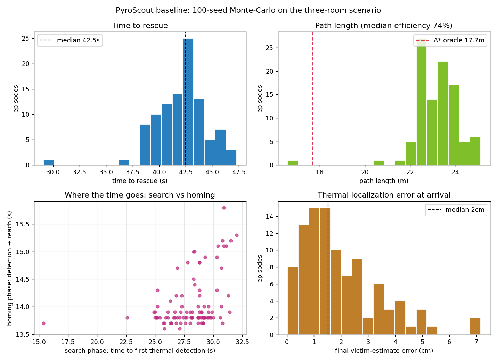
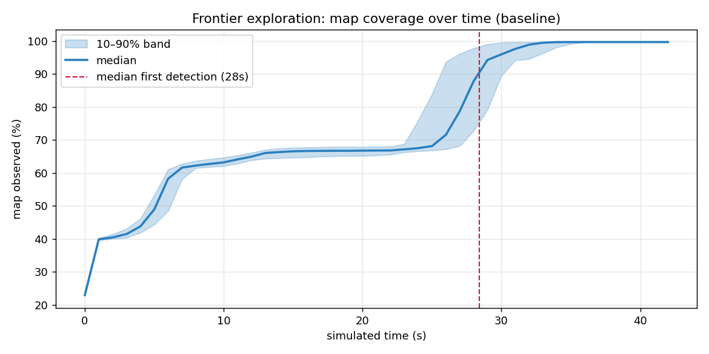
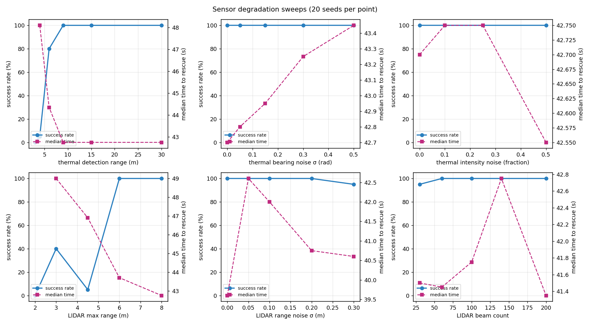
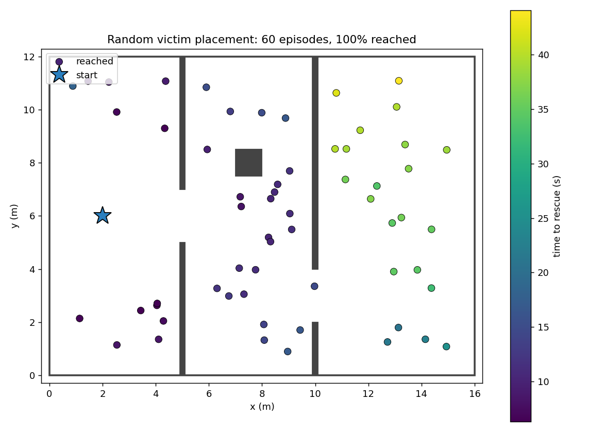

# PyroScout performance analysis

A Monte-Carlo study of the closed-loop navigation stack: how reliably and how
fast the robot finds the victim, how that degrades as the sensors get worse,
and exactly *how* it fails when it fails.

Everything here is produced by [`run_analysis.py`](run_analysis.py):

```bash
python analysis/run_analysis.py          # full study, ~880 episodes (~12 min on 4 cores)
python analysis/run_analysis.py --reuse  # regenerate figures/summary from existing CSV
```

Episodes are deterministic given their seed, so the tables below reproduce
exactly. Raw per-episode metrics land in [`results/episodes.csv`](results/episodes.csv).

## 1. Method

One **episode** = the full perception–plan–act loop from `Navigator.step()`
(LIDAR mapping → thermal fusion → frontier exploration / A* + pure pursuit)
run until the victim is reached, the navigator gives up, or a step budget
(700 steps = 70 s simulated) expires. Four studies share that episode runner:

| Study | Episodes | What varies |
|---|---|---|
| Baseline | 100 seeds | sensor noise realizations only (demo configuration, fixed world) |
| Sensitivity sweeps | 6 parameters × 4–6 levels × 20 seeds | one sensor parameter at a time |
| Budget extension | cliff levels × 20 seeds | step budget tripled to 2,100 steps |
| Random victims | 60 placements | victim position sampled uniformly over reachable space |

Key metrics:

- **Time to rescue** — simulated time until the robot is within 0.5 m of the
  victim estimate, split into **search** (start → first thermal detection) and
  **homing** (first detection → reach).
- **Path efficiency** — shortest-path length from an A* oracle on the
  ground-truth map (minus the 0.5 m reach radius), divided by the distance the
  robot actually drove. The oracle runs on an 8-connected grid, which
  overestimates true shortest paths by up to ~8%, so efficiencies slightly
  above 1.0 are possible on easy geometries.
- **Victim-estimate error** — distance between the fused thermal estimate and
  the true victim position at episode end.
- **Collisions** — steps in which the robot body overlaps a wall (ground-truth
  check, not the robot's own belief).

## 2. Baseline: 100 seeds on the three-room scenario



| Metric | Median | Mean | p10–p90 |
|---|---|---|---|
| Success rate | **99/100** | | |
| Time to rescue | 42.5 s | 42.1 s | 39.4–45.2 s |
| — search phase | 28.4 s | 28.1 s | 25.4–30.7 s |
| — homing phase | 13.8 s | 14.1 s | 13.7–14.9 s |
| Path length | 23.2 m | 23.1 m | 22.3–24.2 m |
| Path efficiency vs oracle (17.7 m) | 74% | 75% | 71–77% |
| Victim-estimate error | 1.5 cm | 2.0 cm | 0.5–4.0 cm |
| Collisions | **0 in 100 episodes** | | |

Three observations:

1. **Search dominates the clock.** Two-thirds of every rescue is spent
   exploring before the first thermal hit; once the victim is seen, homing
   takes an almost constant ~14 s. Speeding up *exploration* (not path
   following) is where time-to-rescue improvements live.
2. **The fused estimate is centimetre-accurate at arrival.** The
   exponential-moving-average filter over noisy thermal detections converges
   from metre-scale initial error to a median 1.5 cm by the time the robot
   arrives — the robot stops where the victim actually is.
3. **The 26% path overhead is the price of searching.** The oracle knows the
   map; the robot has to discover it. Most of the overhead is the exploration
   detour into the middle room, plus the clearance-weighted planner
   deliberately swinging wide of doorframes.

**The one failure (seed 77)** never saw the victim: it spent the full 70 s
budget in `SEARCHING` with only 66% of the map explored and just 10.6 m
driven — long stretches of in-place rotation while frontier targets churned.
An exploration-stall pathology, not a perception or control fault (see §5).

### Map coverage over time



Coverage grows in room-sized steps, not smoothly: the very first scans reveal
~40% of the arena (an 8 m LIDAR sees a long way through doorways), the left
room is finished by ~7 s (~62%), then progress crawls for ~15 s while the
robot threads the middle room and its pillar shadows, and finally the right
room floods in after the wall-B doorway at ~25–30 s — median coverage at
episode end is 99.7%. The 10–90% band is tight: exploration pace is
consistent across noise realizations, and first detection (~28 s) coincides
with entering the final room, as the geometry intends. (The curve is
truncated once fewer than half the episodes are still running, since
fast-finishing episodes stop contributing and would bias the tail.)

## 3. Sensor sensitivity: where the cliffs are



20 seeds per point; "success" lines in blue (left axis), median time-to-rescue
in magenta (right axis).

**Robust axes** — performance is essentially flat across the entire tested
range for:

| Parameter | Tested range | Success |
|---|---|---|
| Thermal bearing noise σ | 0 → 0.5 rad (≈29°!) | 100% everywhere, +0.8 s median time |
| Thermal intensity noise | 0 → 50% relative | 100% everywhere |
| LIDAR range noise σ | 0 → 0.2 m | 100% (95% at an extreme 0.3 m) |
| LIDAR beam count | 200 → 60 beams | 100% (95% at 30 beams) |

The stack earns this robustness structurally: thermal noise is absorbed by
the EMA filter plus continuous replanning (a bad victim estimate is corrected
five steps later), and the log-odds occupancy grid averages LIDAR noise away
over repeated scans. None of these parameters is doing safety-critical work
at its nominal setting — there is wide margin.

**Cliff axes** — two parameters have sharp failure cliffs:

| Parameter | 100% down to | Cliff |
|---|---|---|
| Thermal detection range | 9 m | 80% @ 6 m → **5% @ 4 m → 0% @ 3 m** |
| LIDAR max range | 6 m | **40% @ 3 m, 5% @ 4.5 m, 0% @ 2 m** (non-monotonic, see §5) |

## 4. Failure anatomy: out of time vs terminally stuck

The terminal states of the failures distinguish two different diseases:

| Failure regime | Terminal state | Saw victim? |
|---|---|---|
| Short LIDAR (2–4.5 m) | 100% budget exhaustion (still `SEARCHING`/`NAVIGATING` at 70 s) | sometimes |
| Short thermal (3–4 m) | ~65% hard `FAILED` (stuck), rest budget exhaustion | **never** |

Tripling the step budget to 210 s separates "slow but solvable" from
"terminally stuck":

| Level | Success @ 70 s budget | Success @ 210 s budget | Hard-stuck even at 210 s |
|---|---|---|---|
| LIDAR range 2 m | 0% | **50%** | 0/20 |
| LIDAR range 3 m | 40% | **95%** | 0/20 |
| LIDAR range 4.5 m | 5% | **100%** | 0/20 |
| Thermal range 3 m | 0% | **0%** | 20/20 |
| Thermal range 4 m | 5% | **5%** | 19/20 |
| Thermal range 6 m | 80% | **100%** | 0/20 |

The two cliffs are different problems:

- **Short LIDAR is a *throughput* problem.** The robot maps the world through
  a soda straw, so frontier exploration crawls — but it is making progress,
  and most failures recover given more time. (The 4.5 m anomaly is examined
  in §5.)
- **Short thermal is a *capability gap*.** With a 3–4 m detection range the
  robot can finish exploring the entire building without ever getting a
  thermal hit (the sensor only faces forward, FOV π), at which point the
  frontier list is empty, no behaviour exists for "explored everything,
  found nothing", and the navigator spins in place until the stuck-counter
  declares `FAILED`. **More time does not help — the stack needs a coverage
  behaviour it does not have** (§6, recommendation 1).

## 5. The LIDAR-range anomaly

Why does a 4.5 m LIDAR (5% success) do *worse* than a 3 m one (40%)?
[`diagnose_lidar_range.py`](diagnose_lidar_range.py) instruments the
navigator's internals per step (12 seeds per range, medians):

| LIDAR range | Success | Explore-target churn | In-place rotation | Speed | Map known at end | First detection |
|---|---|---|---|---|---|---|
| 3.0 m | 4/12 | 20 retargets | ~0% of steps | 0.53 m/s | 70% | 52.4 s |
| 4.5 m | 0/12 | 16 retargets | ~0% of steps | 0.54 m/s | **66%** | **65.2 s** |
| 6.0 m | 12/12 | 10 retargets | ~0% of steps | 0.55 m/s | 99% | 41.4 s |
| 8.0 m (nominal) | 12/12 | 8 retargets | ~0% of steps | 0.54 m/s | 100% | 29.0 s |

The failing robot is **not stuck and not slow** — at every range it drives at
the same ~0.54 m/s with essentially zero in-place rotation. What differs is
*route quality*: with a 4.5 m sensor the robot ends each 70 s episode knowing
*less* of the map than with a 3 m sensor, despite the longer reach, and it
first sights the victim 13 s later.

The mechanism is the frontier-selection economics. A 3 m sensor only ever
generates frontiers *near the robot*, so exploration degenerates into short
local hops — slow but steadily productive. A ≥6 m sensor swallows whole rooms
in a few scans, so only a handful of targets are ever needed. A 4.5 m sensor
is in the worst spot in between: scans reach through doorways far enough to
spawn attractive distant frontier clusters across the building, and the
utility function (`distance − 0.15 × cluster size`) commits the robot to long
transits through already-mapped space to service them — many metres driven
per square metre of new map. The budget-extension result (§4) corroborates
this reading: given 3× the time, 4.5 m recovers completely (5% → 100%
success, zero stuck episodes) — it is an exploration-efficiency problem, not
a terminal one.

## 6. Generalization: random victim placement



60 episodes with the victim sampled uniformly over reachable space (≥3.5 m
from the start), nominal sensors:

- **60/60 reached**, zero collisions.
- Median time to rescue 14.1 s (most random placements are easier than the
  demo's worst-case far corner: the thermal sensor often acquires the victim
  during early exploration).
- Median path efficiency 1.00 — when the victim is visible early, the robot
  drives a near-straight line to it. The demo scenario, with its offset
  doorways and victim hidden two rooms away, sits in the hardest part of the
  placement distribution by design.

The stack is not tuned to one goal location: success is uniform across both
near and far placements, including victims tucked behind the pillar and in
the wall-A/wall-B doorway shadows.

## 7. Recommendations

Ordered by measured impact:

1. **Add a coverage-search fallback** for "frontiers exhausted, no detection".
   A lawnmower sweep over known-free space with lanes spaced by thermal range
   (plus an in-place 360° "periscope" spin at lane ends to compensate for the
   forward-only FOV) would convert most short-thermal hard failures —
   currently 0–5% success at ≤4 m — into slow successes.
2. **Add exploration-stall detection.** Baseline seed 77 and the short-LIDAR
   regime both lose time to frontier-target churn and in-place rotation. A
   watchdog on map-growth-per-metre-driven that forces a far-field retarget
   (or temporarily relaxes the visited-target blacklist) addresses both.
3. **Raise search-phase speed.** Homing is near-optimal; search is 2/3 of the
   clock. The pure-pursuit `v_nominal` of 0.6 m/s (vs `v_max` 0.8) is
   conservative during exploration in open space — clearance-gated speed
   scheduling could cut ~15–20% off time-to-rescue at zero collision cost
   (clearance data is already computed for the planner's comfort term).
4. **Spec the sensors against the cliffs, not the means.** Procurement-wise:
   thermal range needs ≥1.5× the largest room dimension (here ≥9 m), LIDAR
   range ≥ the longest corridor sightline (here ≥6 m). Noise specs barely
   matter; range specs are everything.

## Limitations

- The robot has **perfect self-localization** (no odometry drift / SLAM
  error); real-world figures would degrade, particularly the cm-level
  estimate error.
- Single static world family; no dynamic obstacles, no multi-victim
  scenarios.
- The A* oracle's 8-connectivity overestimates shortest paths by up to ~8%,
  so true path efficiencies are slightly lower than reported.
- 20 seeds per sweep point resolves cliffs, not single-digit percentage
  differences; treat small success-rate gaps between adjacent levels as noise.
