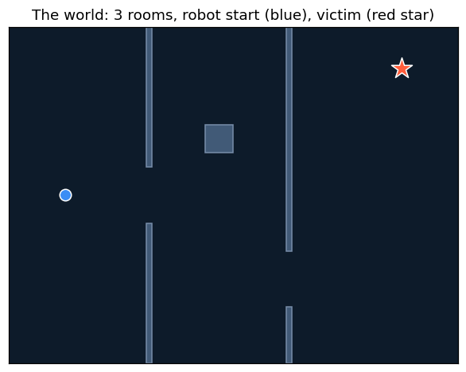
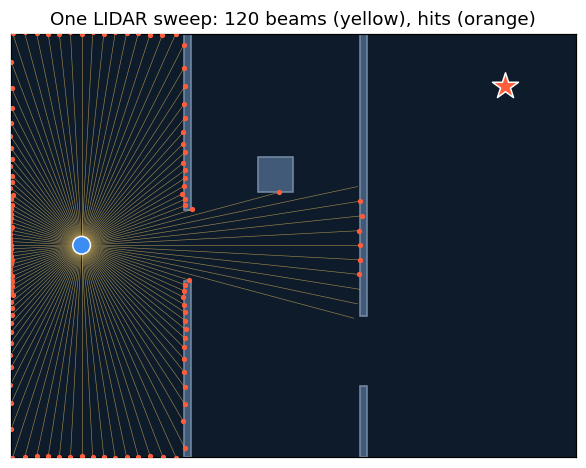
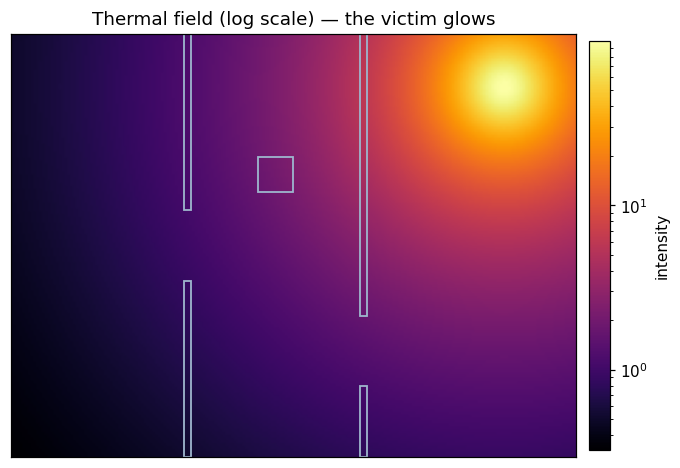
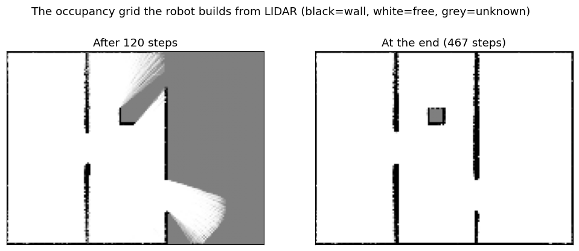
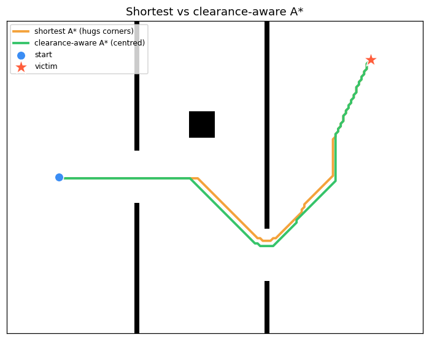
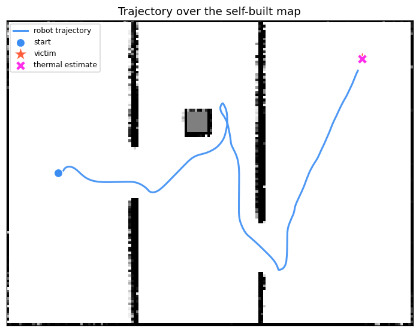

# PyroScout: teaching a robot to find people with heat *and* light

*A walk-through of a small, from-scratch autonomous-robotics project — building
the full "autonomy stack" for a search-and-rescue robot that fuses a LIDAR and a
thermal sensor.*

---

Imagine a robot rolled into a smoke-filled building it has never seen. Somewhere
inside is a person who needs help. The robot has two senses:

* a **LIDAR**, which measures distances to surfaces — it tells the robot *where
  the walls are*, but not what matters;
* a **thermal sensor**, which sees body heat — it tells the robot *where the
  person is*, but nothing about the walls in between.

Neither sense is enough alone. **PyroScout** is a 2D simulator that fuses them
into a single autonomous behaviour: explore the unknown, detect the heat, plan a
safe path, and drive to the victim — without ever hitting a wall.


> **Left:** the ground truth the robot can't see. **Right:** the map it *builds*
> from LIDAR, with its live plan drawn on top.

In one run it reaches the victim with **0 collisions** and localises them to
within **a couple of centimetres**, purely from noisy sensor data. Let's build
it up one layer at a time.

## The big idea: geometry vs. semantics

The whole project hinges on a separation that shows up all over robotics:

| | LIDAR | Thermal |
|---|---|---|
| **Measures** | distance to surfaces | radiated heat |
| **Answers** | *"where are the walls?"* | *"where is the heat?"* |
| **Role** | builds the **map** | picks the **goal** |
| **Weakness** | no idea what's important | no idea what's in the way |

The robot's "brain" turns this into a loop:

```
       sense ──▶ map (LIDAR)  ──▶ plan ──▶ control ──▶ move
         │        goal (thermal) ──┘                     │
         └──────────────────────────────────────────────┘
```

Everything below is a layer of that loop.

## Setup

Install the package (`pip install -e .` from the repo) and import the pieces.


```python
%matplotlib inline
import numpy as np
import matplotlib.pyplot as plt
from matplotlib.patches import Rectangle as MRect, Circle
from matplotlib.collections import LineCollection

plt.rcParams.update({"figure.figsize": (8, 5), "figure.dpi": 110})

from pyroscout.world import World, Rectangle, HeatSource
from pyroscout.geometry import Pose
from pyroscout.sensors import Lidar2D, ThermalSensor
from pyroscout.mapping import OccupancyGrid
from pyroscout.planning import astar
from pyroscout.scenarios import demo_navigator, search_rescue_world
from pyroscout.navigator import Navigator, NavState

print("PyroScout ready.")
```

    PyroScout ready.


## 1. The world

The test environment is a small three-room "building". Two interior walls have
**offset doorways**, so the robot has to wind through the middle room — and,
crucially, it **cannot see the victim's heat** from the start because walls block
infrared. The robot begins blind in the left room (blue); the victim (red star)
is in the far right room.


```python
def draw_world(ax, world):
    ax.set_aspect("equal"); ax.set_xlim(0, world.width); ax.set_ylim(0, world.height)
    ax.set_facecolor("#0d1b2a"); ax.set_xticks([]); ax.set_yticks([])
    for o in world.obstacles:
        ax.add_patch(MRect((o.x, o.y), o.w, o.h, facecolor="#415a77", edgecolor="#778da9"))
    for s in world.heat_sources:
        ax.scatter(s.x, s.y, marker="*", s=320, color="#ff5d3b", edgecolors="white", zorder=5)

world, start = search_rescue_world()
fig, ax = plt.subplots()
draw_world(ax, world)
ax.scatter(start.x, start.y, marker="o", s=90, color="#3b8df4", edgecolors="white", zorder=5)
ax.set_title("The world: 3 rooms, robot start (blue), victim (red star)")
plt.show()
```


    

    


## 2. LIDAR — seeing geometry

A LIDAR fires laser beams in many directions and times the reflections. We
simulate this by **ray casting**: for each beam, solve for the nearest wall
segment it strikes. The clever bit is doing all beams against all walls in one
vectorised linear-algebra step, then adding a little noise to mimic a real
sensor.

Below is a single 360° sweep from the start position. Notice the **shadows** —
the robot only learns about surfaces it can actually see.


```python
lidar = Lidar2D(num_beams=120, max_range=8.0, noise_std=0.03, seed=0)
scan = lidar.scan(start, world)

fig, ax = plt.subplots()
draw_world(ax, world)
ends = scan.endpoints()
ax.add_collection(LineCollection([[(start.x, start.y), tuple(e)] for e in ends],
                                 colors="#ffd166", linewidths=0.4, alpha=0.6))
ax.scatter(ends[scan.hit_mask, 0], ends[scan.hit_mask, 1], s=6, color="#ff5d3b", zorder=4)
ax.add_patch(Circle((start.x, start.y), 0.25, facecolor="#3b8df4", edgecolor="white", zorder=6))
ax.set_title(f"One LIDAR sweep: {lidar.num_beams} beams (yellow), hits (orange)")
plt.show()
```


    

    


## 3. The thermal sensor — seeing heat

Heat radiates and falls off with the square of distance, so a source of strength
$I_0$ at distance $d$ reads:

$$\text{measured} = \frac{I_0}{d^2 + 1}$$

Because that relationship is invertible, a calibrated sensor can turn a raw
intensity reading back into a **range estimate**:
$d_\text{est} = \sqrt{I_0/\text{measured} - 1}$. Combined with the bearing, that
single reading becomes a *position* estimate for the victim.

Two things make it realistic — and make the search hard:

* **Occlusion**: walls block infrared, so the victim is only detected with clear
  line of sight. From the start position the victim is hidden; the robot has to
  physically get around corners first.
* **Noise**: bearing and intensity are corrupted, so the estimate is smoothed
  over time.


```python
thermal = ThermalSensor(fov=np.pi, max_range=30.0, seed=0)

print("From the start (victim behind two walls):")
print("   detections:", thermal.sense(start, world), "  <- blocked by occlusion\n")

los_pose = Pose(12.0, 8.0, 0.9)  # standing in the right room, facing the victim
dets = thermal.sense(los_pose, world)
print("From inside the right room (clear line of sight):")
for d in dets:
    est = d.estimated_position(los_pose)
    print(f"   bearing={np.degrees(d.bearing):.1f} deg, "
          f"est. range={d.est_range:.2f} m -> est. position=({est[0]:.2f}, {est[1]:.2f})")
print("   true victim position:", tuple(world.heat_sources[0].xy))
```

    From the start (victim behind two walls):
       detections: []   <- blocked by occlusion
    
    From inside the right room (clear line of sight):
       bearing=51.1 deg, est. range=3.19 m -> est. position=(14.00, 10.48)
       true victim position: (np.float64(14.0), np.float64(10.5))


We can also visualise the underlying thermal *field* the sensor samples from — bright where it's hot, fading with distance:


```python
xs, ys = np.meshgrid(np.linspace(0, world.width, 200), np.linspace(0, world.height, 150))
field = thermal.field_at(xs, ys, world)

fig, ax = plt.subplots()
im = ax.imshow(field, origin="lower", extent=(0, world.width, 0, world.height),
               cmap="inferno", norm="log")
for o in world.obstacles:
    ax.add_patch(MRect((o.x, o.y), o.w, o.h, facecolor="none", edgecolor="#9db4cc", lw=1.2))
ax.set_title("Thermal field (log scale) — the victim glows"); ax.set_xticks([]); ax.set_yticks([])
fig.colorbar(im, ax=ax, fraction=0.03, pad=0.02, label="intensity")
plt.show()
```


    

    


## 4. Mapping — building a picture from nothing

The robot starts with **no map**. Every LIDAR sweep updates an **occupancy
grid** that stores, per cell, the *log-odds* of being occupied:

$$\ell = \log\frac{p(\text{occupied})}{p(\text{free})}$$

Log-odds make Bayesian updates trivial — they become additions. Cells a beam
passes *through* get "more free"; the cell it lands *in* gets "more occupied".
Starting from $\ell = 0$ (totally unknown), the map sharpens as evidence builds.

Let's run the full robot once and watch the map fill in — early in the run vs.
at the end.


```python
nav, world, robot = demo_navigator(seed=0)
result = nav.run(max_steps=700)

early_idx = min(120, len(result.history) - 1)
early = result.history[early_idx].grid_prob
late = nav.grid.prob

fig, axs = plt.subplots(1, 2, figsize=(11, 4.4))
for ax, data, title in [(axs[0], early, f"After {early_idx} steps"),
                        (axs[1], late, f"At the end ({result.steps} steps)")]:
    ax.imshow(data, origin="lower", extent=(0, world.width, 0, world.height),
              cmap="gray_r", vmin=0, vmax=1)
    ax.set_title(title); ax.set_xticks([]); ax.set_yticks([])
fig.suptitle("The occupancy grid the robot builds from LIDAR (black=wall, white=free, grey=unknown)")
plt.show()
```


    

    


## 5. Planning — A\* that respects clearance

Given a map and a goal, **A\*** finds the optimal path on the grid. Two details
matter for a *physical* robot:

1. **No corner-cutting** — diagonal moves that would clip a wall corner are
   forbidden.
2. **Clearance awareness** — plain shortest-path hugs walls and scrapes doorway
   corners. We add a *cost field* (computed from a distance transform) that
   penalises cells near walls, so the planner prefers the **middle** of
   corridors.

The difference is clear when we plan the same start→victim route both ways: 


```python
from pyroscout.navigator import _nearest_free

def rasterise(world, res=0.1):
    g = OccupancyGrid(world.width, world.height, res)
    for cy in range(g.ny):
        for cx in range(g.nx):
            wx, wy = g.grid_to_world(cx, cy)
            g.log_odds[cy, cx] = g.l_clamp if world.in_collision(wx, wy) else -g.l_clamp
    return g

def plan(g, s_xy, g_xy, inflate, weight):
    blocked = g.costmap(inflate_radius=inflate)
    s = _nearest_free(blocked, g.world_to_grid(*s_xy))
    t = _nearest_free(blocked, g.world_to_grid(*g_xy))
    cost = weight * np.maximum(0.0, 0.7 - g.clearance_m()) if weight else None
    return np.array([g.grid_to_world(cx, cy) for cx, cy in astar(blocked, s, t, cost_grid=cost)])

grid = rasterise(world)
goal_xy = world.heat_sources[0].xy
naive = plan(grid, start.xy, goal_xy, 0.45, 0.0)
safe  = plan(grid, start.xy, goal_xy, 0.45, 5.0)

fig, ax = plt.subplots(figsize=(8, 6))
ax.imshow(grid.prob, origin="lower", extent=(0, world.width, 0, world.height), cmap="gray_r", vmin=0, vmax=1)
ax.plot(naive[:, 0], naive[:, 1], color="#f4a23b", lw=2.5, label="shortest A* (hugs corners)")
ax.plot(safe[:, 0], safe[:, 1], color="#36c46a", lw=2.5, label="clearance-aware A* (centred)")
ax.scatter(*start.xy, c="#3b8df4", s=90, edgecolors="white", zorder=5, label="start")
ax.scatter(*goal_xy, marker="*", s=260, c="#ff5d3b", edgecolors="white", zorder=5, label="victim")
ax.legend(loc="upper left", fontsize=8); ax.set_xticks([]); ax.set_yticks([])
ax.set_title("Shortest vs clearance-aware A*")
plt.show()
```


    

    


## 6. The brain — control and fusion

Two final pieces turn a plan into motion and motion into a *mission*.

**Pure-pursuit control** converts the path into velocity commands by steering
toward a "carrot" point a fixed lookahead distance ahead — simple, smooth, and
the workhorse of real path followers.

**The behaviour state machine** is where the two senses fuse:

* `SEARCHING` — no victim seen yet, so use **frontier exploration**: drive to the
  boundary between mapped and unknown space to grow the map. Frontiers are
  clustered and chosen by a proximity-vs-size trade-off, with commitment and
  visited-memory so the robot doesn't dither.
* `NAVIGATING` — the instant thermal gets line of sight, plan to the fused victim
  estimate and follow it, replanning as the map grows. If the victim isn't
  reachable yet, explore *toward* it — mapping around the blocking wall.
* `REACHED` — arrived.

Here's the path the robot actually drove, over the final map it built:


```python
xs = [r.pose.x for r in result.history]
ys = [r.pose.y for r in result.history]

fig, ax = plt.subplots(figsize=(8, 6))
ax.imshow(nav.grid.prob, origin="lower", extent=(0, world.width, 0, world.height), cmap="gray_r", vmin=0, vmax=1)
ax.plot(xs, ys, color="#3b8df4", lw=2, alpha=0.9, label="robot trajectory")
ax.scatter(xs[0], ys[0], c="#3b8df4", s=90, edgecolors="white", zorder=5, label="start")
ax.scatter(*world.heat_sources[0].xy, marker="*", s=260, c="#ff5d3b", edgecolors="white", zorder=5, label="victim")
if result.goal_estimate is not None:
    ax.scatter(*result.goal_estimate, marker="X", s=120, c="#ff2eea", edgecolors="white", zorder=6, label="thermal estimate")
ax.legend(loc="upper left", fontsize=8); ax.set_xticks([]); ax.set_yticks([])
ax.set_title("Trajectory over the self-built map")
plt.show()

err = float(np.hypot(*(result.goal_estimate - world.heat_sources[0].xy)))
print(f"Outcome        : {'REACHED' if result.success else result.state.value}")
print(f"Steps          : {result.steps}  ({result.sim_time:.1f} s simulated)")
print(f"Distance       : {result.path_length:.1f} m")
print(f"Collisions     : {result.collisions}")
print(f"Localisation   : {err*100:.1f} cm from the true victim position")
```


    

    


    Outcome        : REACHED
    Steps          : 467  (46.7 s simulated)
    Distance       : 25.1 m
    Collisions     : 0
    Localisation   : 1.2 cm from the true victim position


## Putting it together

That trajectory is the whole stack working as one: the robot sweeps the left and
middle rooms (frontier exploration), threads the offset doorways
(clearance-aware planning), catches the victim's heat the moment it rounds the
last corner (thermal + occlusion), fuses that into a centimetre-accurate goal,
and drives home (pure pursuit) — **without a single collision**.

### What this project demonstrates

- Sensor modelling (ray casting, inverse-square heat, occlusion, noise)
- Probabilistic mapping (log-odds occupancy grids)
- Autonomous exploration (frontier search)
- Graph search and cost-aware planning (A\* + clearance fields)
- Closed-loop control (pure pursuit)
- Sensor fusion and decision-making (a behaviour state machine)

### Where it could go next

- **Localisation** (a particle filter) to drop the perfect-odometry assumption →
  true SLAM.
- **Local planning** (Dynamic Window Approach) for moving obstacles.
- **Real data**: the architecture maps directly onto a 3D LIDAR projected to 2D
  and a real thermal camera.

The full source — every layer above is one small, readable module — plus tests
and CI, is on GitHub. Thanks for reading!
